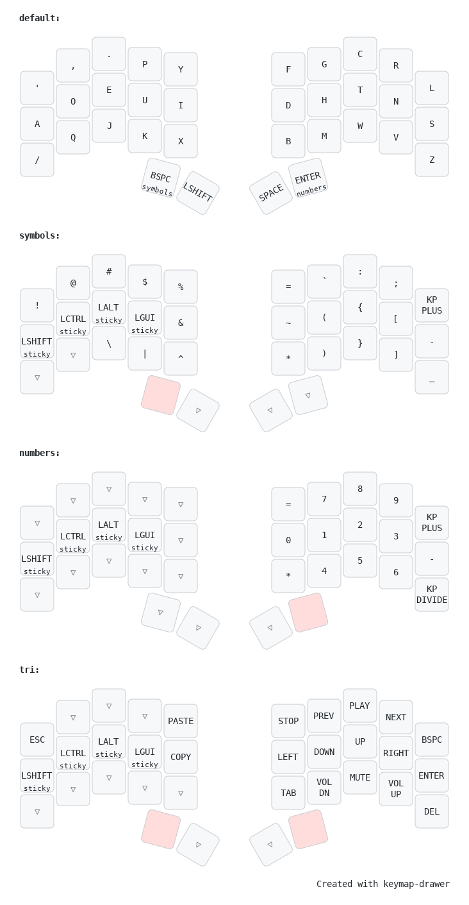

# ZMK Config for Ferris Sweep (34 Keys)

This repository contains my custom ZMK configuration and keymaps for the 34-key [Ferris Sweep](https://github.com/davidphilipbarr/Sweep), a minimalist split keyboard. The layout is heavily inspired by the [Seniply](https://stevep99.github.io/seniply/) layout, with adjustments tailored to fit my workflow and ergonomic needs.

## Layers Overview

1. Default Layer (DVORAK):\
_Base layer using the DVORAK layout, maintaining improved ergonomics for comfortable and efficient typing._

2. Symbols Layer:\
_Provides easy access to programming symbols, brackets, and special characters._

3. Numbers Layer:\
_A dual-purpose layer for numeric input and navigation between workspaces._

4. Navigation/Media Layer:\
_Includes arrow keys, media controls, and essential system shortcuts for multitasking efficiency._

## Keymap Visualization

